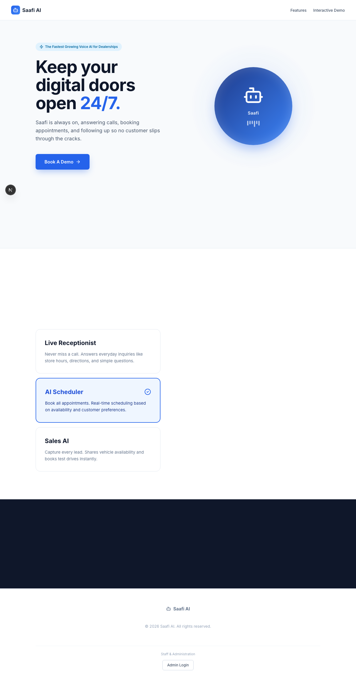
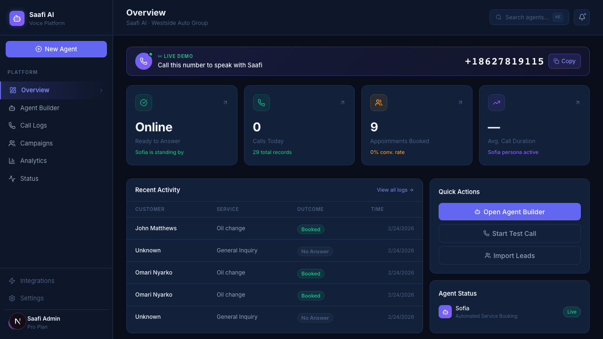

# Saafi AI — Voice Agent Platform

An AI voice agent platform for automating dealership calls — service scheduling, lead follow-ups, and inbound inquiries.

## Stack
- **Backend**: FastAPI (Python) + Vapi.ai RTC
- **Frontend**: Next.js 16 (App Router) + Tailwind CSS
- **DB**: PostgreSQL + Redis (Upstash)

## Screenshots
### Landing Page


### Admin Dashboard


## Getting Started

### Backend
```bash
cd backend
python -m venv venv && source venv/bin/activate
pip install -r requirements.txt
cp .env.example .env   # fill in your keys
uvicorn main:app --reload
```

### Frontend
```bash
cd frontend
npm install
npm run dev
```

Dashboard: http://localhost:3000 · API: http://localhost:8000
